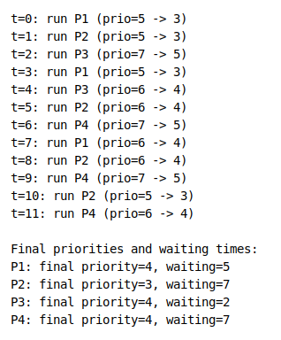
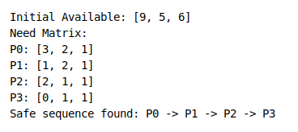
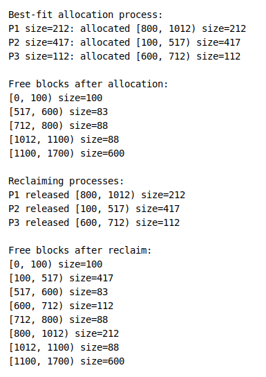

# 操作系统实验任务结果

## 一、最高优先权优先调度 (Highest Priority First)

优先数变化规则：
- 进程在就绪队列中等待 1 个时间片，优先数 +1。
- 进程每运行 1 个时间片，优先数 -2。

本次仿真进程集合：
- P1: 到达时间 0，运行时间 3，初始优先数 5
- P2: 到达时间 1，运行时间 4，初始优先数 4
- P3: 到达时间 2，运行时间 2，初始优先数 6
- P4: 到达时间 3，运行时间 3，初始优先数 3

运行结果截图：

## 二、银行家算法

资源总量：A=9, B=5, C=6。

运行结果截图：

## 三、动态分区分配（最佳适应算法）

内存块设定：
- [0, 100) 100
- [100, 600) 500
- [600, 800) 200
- [800, 1100) 300
- [1100, 1700) 600

进程申请大小：212、417、112。

运行结果截图：

## 四、LRU 页面置换算法

页号序列：3, 5, 2, 1, 4, 2, 5, 3, 1, 2, 6, 4, 3, 2, 5, 7, 2, 4, 1, 6。

页框数：3。

运行结果截图：

